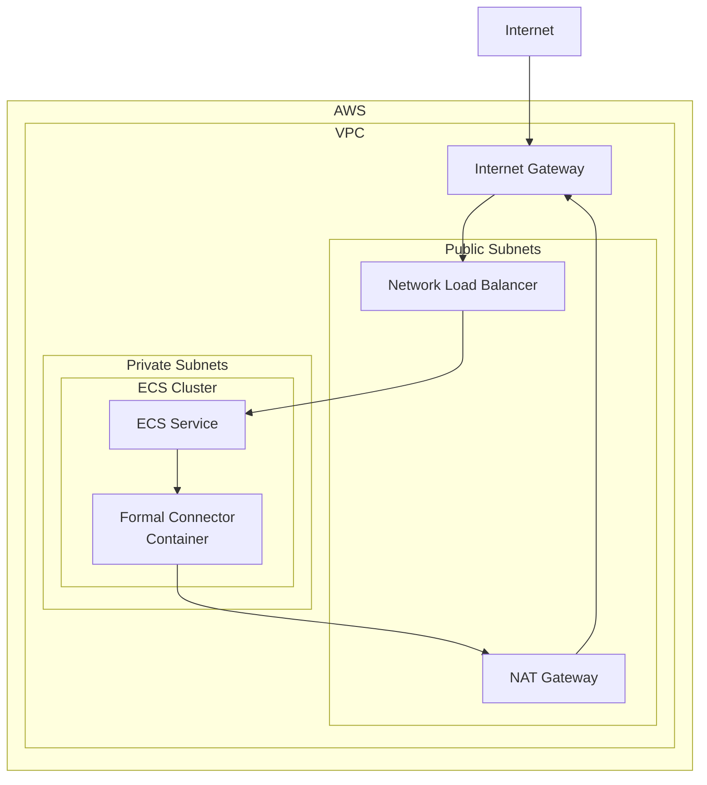

# Formal Connector - AWS ECS Deployment

This Terraform configuration deploys a production-ready Formal Connector on AWS using ECS Fargate. It creates:

- **Isolated networking**: New VPC with public/private subnets across multiple AZs
- **ECS Fargate service**: Running the Formal Connector container
- **Internet access**: Network Load Balancer for external connectivity
- **CloudWatch logging**: For container monitoring
- **Secure IAM roles**: With minimal required permissions

The Connector will be accessible from the internet and ready to proxy connections to your databases.

## How to Use

### 1. Prerequisites
- AWS CLI configured with appropriate credentials
- Terraform >= 0.14.9 installed
- A Formal API key (obtain from your Formal dashboard)

### 2. Set Required Variables

Create a `terraform.tfvars` file:

```hcl
# Required variables
region             = "us-west-2"
availability_zones = ["us-west-2a", "us-west-2b"]
formal_api_key     = "your-formal-api-key"
formal_org_name    = "your-org-name"  # Provided by Formal

# Optional: customize networking (defaults provided)
# vpc_cidr              = "172.0.0.0/16"
# private_subnet_cidrs  = ["172.0.1.0/24", "172.0.2.0/24"]
# public_subnet_cidrs   = ["172.0.101.0/24", "172.0.102.0/24"]

# Optional: customize resources (defaults provided)
# name            = "demo-env"
# environment     = "demo-formal-env"
# container_cpu   = 1024
# container_memory = 2048
```

### 3. Deploy

```bash
# Initialize Terraform
terraform init

# Plan the deployment
terraform plan

# Apply the configuration
terraform apply
```

### 4. Access Your Connector

After deployment:
1. The Connector will be available at the provided hostname
2. Configure your applications to connect through the Connector
3. Monitor logs in CloudWatch under the `/ecs/{name}` log group

## Resources Deployed

### Networking Infrastructure
- **VPC**: Isolated network environment with DNS support
- **Public Subnets**: 2 subnets across different AZs for internet-facing resources
- **Private Subnets**: 2 subnets across different AZs for internal resources
- **Internet Gateway**: Enables internet access for public subnets
- **NAT Gateways**: Allow private subnet resources to access internet (one per AZ)
- **Route Tables**: Configure traffic routing for public and private subnets
- **Elastic IPs**: Static IP addresses for NAT Gateways

### Load Balancer
- **Network Load Balancer**: Internet-facing load balancer for high performance
- **Security Group**: Controls network access to the load balancer

### ECS Infrastructure
- **ECS Cluster**: Container orchestration platform
- **ECS Task Definition**: Defines the Connector container configuration
- **ECS Service**: Manages running instances of the Connector
- **Security Group**: Controls network access to ECS tasks

### Storage & Monitoring
- **CloudWatch Log Group**: Centralized logging for Connector container
- **Secrets Manager**: Secure storage for the Formal API key

### IAM Roles & Policies
- **ECS Task Execution Role**: Allows ECS to pull images and access logs
- **ECS Task Role**: Runtime permissions for the Connector container
- **IAM Policies**: Minimal permissions for Secrets Manager and CloudWatch access

## Architecture



## Clean Up

To remove all resources:

```bash
terraform destroy
```

This will remove all AWS resources created by this configuration.
