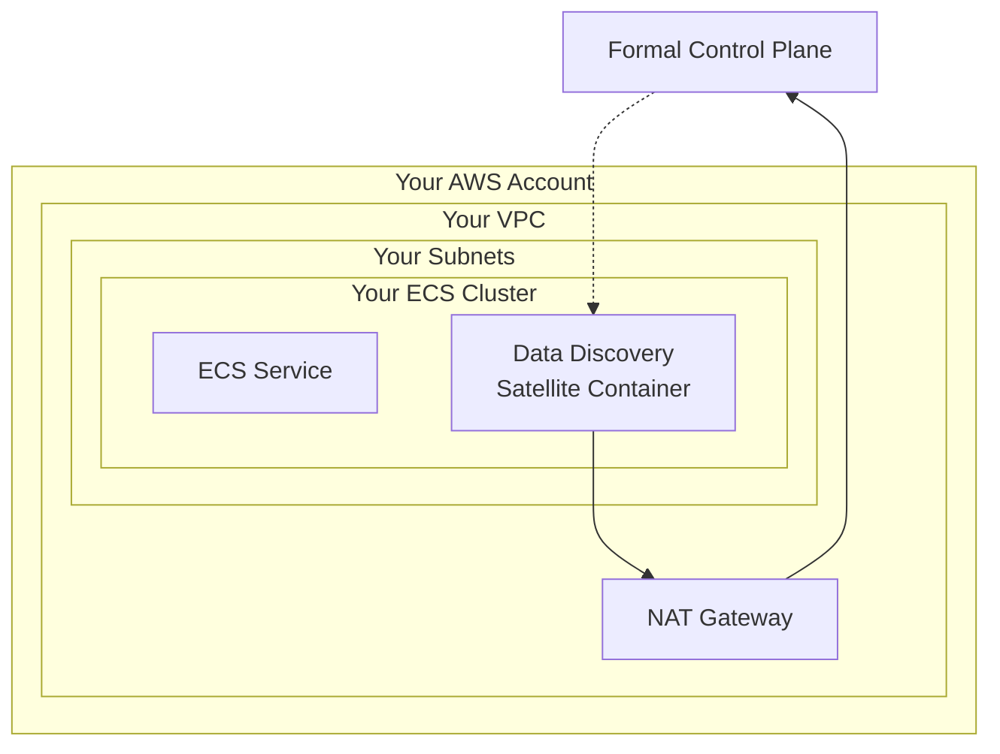

# Formal Data Discovery Satellite - AWS ECS Deployment

This Terraform configuration deploys a Formal Data Discovery Satellite on AWS using ECS Fargate. Unlike the full Connector deployment, this configuration uses your existing infrastructure:

- **User-provided networking**: Uses your existing VPC, subnets, and security groups
- **User-provided ECS cluster**: Deploys to your existing ECS cluster
- **ECS Fargate service**: Running the Formal Data Discovery Satellite container
- **CloudWatch logging**: For container monitoring
- **Secure IAM roles**: With minimal required permissions

The Data Discovery Satellite connects to the Formal Control Plane to enable data discovery capabilities across your infrastructure.

## Prerequisites

- AWS CLI configured with appropriate credentials
- Terraform >= 1.0 installed
- A Formal API key (obtain from your Formal dashboard)
- An existing ECS cluster
- An existing VPC with subnets (private subnets with NAT gateway access recommended)
- Security groups configured to allow outbound HTTPS traffic

## Setup

### 1. Set Required Variables

Create a `terraform.tfvars` file:

```hcl
# Required variables
region         = "us-west-2"
formal_api_key = "your-formal-api-key"  # Provided by Formal

# User-provided networking
vpc_id             = "vpc-xxxxxxxxx"
subnet_ids         = ["subnet-xxxxxxxxx", "subnet-yyyyyyyyy"]
security_group_ids = ["sg-xxxxxxxxx"]

# User-provided ECS cluster
ecs_cluster_arn = "arn:aws:ecs:us-west-2:123456789012:cluster/your-cluster-name"

# Optional: customize resources (defaults provided)
# name             = "formal-data-discovery-satellite"
# container_cpu    = 1024
# container_memory = 2048
# desired_count    = 1
# assign_public_ip = false
# tags             = { Environment = "production" }
```

### 2. Deploy

```bash
# Initialize Terraform
terraform init

# Plan the deployment
terraform plan

# Apply the configuration
terraform apply
```

### 3. Verify Deployment

After deployment completes, verify the service is running:

```bash
# Check ECS service status
aws ecs describe-services \
  --cluster your-cluster-name \
  --services $(terraform output -raw ecs_service_name) \
  --region us-west-2

# View container logs
aws logs tail $(terraform output -raw cloudwatch_log_group_name) --follow
```

## Resources Deployed

### ECS Infrastructure
- **ECS Task Definition**: Defines the Data Discovery Satellite container configuration
- **ECS Service**: Manages running instances of the satellite

### Storage & Monitoring
- **CloudWatch Log Group**: Centralized logging for the satellite container (7-day retention)
- **Secrets Manager Secret**: Secure storage for the Formal API key

### IAM Roles & Policies
- **ECS Task Execution Role**: Allows ECS to pull images from Formal's ECR and access secrets
- **ECS Task Role**: Runtime permissions for the satellite container
- **IAM Policies**: Minimal permissions for Secrets Manager and cross-account ECR access

## Architecture



## Security Considerations

### Network Requirements
- The Data Discovery Satellite requires outbound HTTPS (port 443) access to communicate with the Formal Control Plane
- If using private subnets, ensure NAT gateway access is available
- No inbound traffic is required

### IAM Permissions
The deployment creates IAM roles with minimal permissions:
- **Task Execution Role**: Access to Secrets Manager for API key retrieval, cross-account ECR access for pulling the container image
- **Task Role**: No additional permissions by default (extend as needed for your use case)

## Configuration Options

| Variable | Required | Default | Description |
|----------|----------|---------|-------------|
| `formal_api_key` | Yes | - | Formal Control Plane API Key |
| `region` | Yes | - | AWS region for deployment |
| `vpc_id` | Yes | - | ID of your VPC |
| `subnet_ids` | Yes | - | List of subnet IDs for the ECS service |
| `security_group_ids` | Yes | - | List of security group IDs |
| `ecs_cluster_arn` | Yes | - | ARN of your ECS cluster |
| `name` | No | `formal-data-discovery-satellite` | Name prefix for resources |
| `container_cpu` | No | `1024` | CPU units (1024 = 1 vCPU) |
| `container_memory` | No | `2048` | Memory in MB |
| `desired_count` | No | `1` | Number of tasks to run |
| `assign_public_ip` | No | `false` | Assign public IP to tasks |
| `image_tag` | No | `latest` | Container image tag |
| `tags` | No | `{}` | Tags to apply to resources |

## Troubleshooting

If you encounter issues:

- **Check ECS service events**: `aws ecs describe-services --cluster <cluster> --services <service>`
- **Check container logs**: `aws logs tail /ecs/formal-data-discovery-satellite --follow`
- **Verify network connectivity**: Ensure subnets have outbound internet access via NAT gateway
- **Check IAM permissions**: Verify the task execution role can access Secrets Manager and ECR

If you still encounter issues, please reach out to the Formal team!

## Clean Up

To remove all resources:

```bash
terraform destroy
```

This will remove the ECS service, task definition, IAM roles, secrets, and log group. Your VPC, subnets, security groups, and ECS cluster will remain unchanged.
