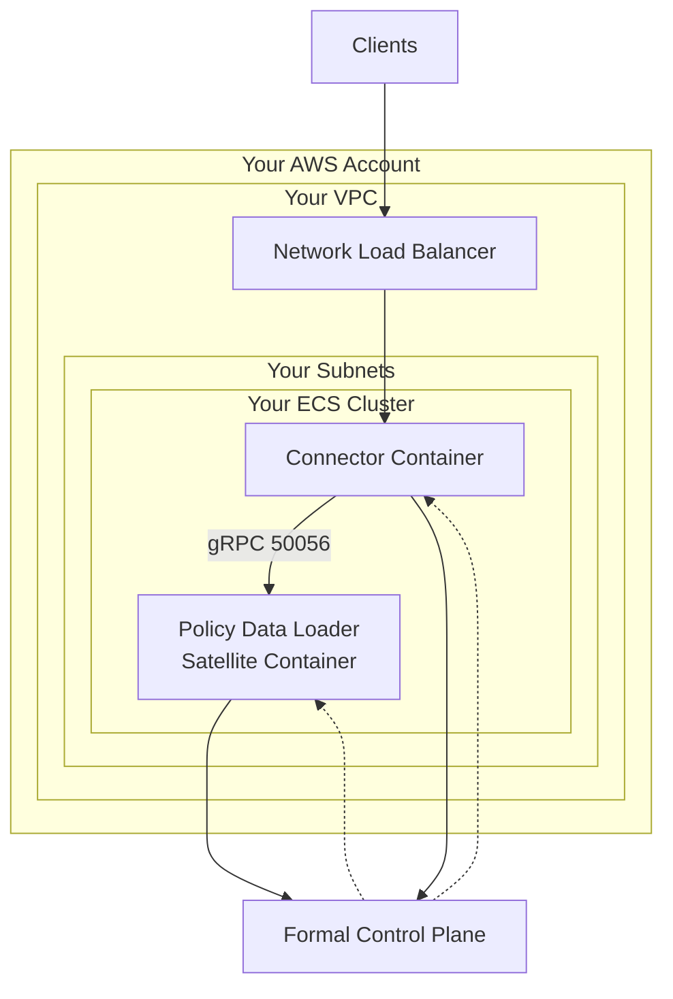

# Formal Connector + Policy Data Loader Satellite - AWS ECS Deployment

This Terraform configuration deploys a Formal Connector and a Policy Data Loader Satellite on AWS using ECS Fargate, into your existing infrastructure:

- **User-provided networking**: Uses your existing VPC and subnets
- **User-provided ECS cluster**: Deploys both services to your existing ECS cluster
- **Two ECS Fargate services**: The Connector and the Policy Data Loader Satellite, running side by side
- **Network load balancer**: Fronts the Connector so clients can reach it
- **CloudWatch logging**: For container monitoring
- **Secure IAM roles**: With minimal required permissions

The Connector and the Satellite run in the same ECS cluster so they can communicate with each other, which is required for the Connector to route policy-data-loader traffic to the Satellite. Both connect to the Formal Control Plane, and the Satellite loads your custom data (for example dynamic allow/deny lists) into the policy engine.

## Prerequisites

- AWS CLI configured with appropriate credentials
- Terraform >= 1.0 installed
- A Formal API key (obtain from your Formal dashboard)
- An existing ECS cluster
- An existing VPC with subnets (public subnets recommended, or private subnets with NAT gateway)
- Your AWS account allow-listed by Formal to pull images from Formal's ECR (ask your Formal contact)

## Setup

### 1. Set Required Variables

Create a `terraform.tfvars` file:

```hcl
# Required variables
region         = "us-west-2"
formal_api_key = "your-formal-api-key" # Provided by Formal

# User-provided networking
vpc_id         = "vpc-xxxxxxxxx"
subnet_ids     = ["subnet-xxxxxxxxx", "subnet-yyyyyyyyy"] # ECS task ENIs
nlb_subnet_ids = ["subnet-xxxxxxxxx", "subnet-yyyyyyyyy"] # Connector load balancer

# User-provided ECS cluster
ecs_cluster_arn = "arn:aws:ecs:us-west-2:123456789012:cluster/your-cluster-name"

# Optional: customize the Connector (defaults provided)
# connector_ports               = [443]
# connector_ingress_cidr_blocks = ["0.0.0.0/0"]
# connector_desired_count       = 3
# nlb_internal                  = false

# Optional: customize resources (defaults provided)
# name             = "formal"
# ecr_region       = "us-east-1" # region to pull Formal images from
# assign_public_ip = false       # set true when running tasks in public subnets
# tags             = { Environment = "poc" }
```

### 2. Deploy

```bash
# Initialize Terraform
terraform init

# Plan the deployment
terraform plan

# Apply the configuration
terraform apply
```

### 3. Verify Deployment

After deployment completes, verify both services are running:

```bash
# Check ECS service status
aws ecs describe-services \
  --cluster your-cluster-name \
  --services $(terraform output -raw connector_service_name) $(terraform output -raw satellite_service_name) \
  --region us-west-2

# View container logs
aws logs tail $(terraform output -raw connector_log_group_name) --follow
aws logs tail $(terraform output -raw satellite_log_group_name) --follow
```

Clients connect to the Connector through the load balancer at the `connector_nlb_dns_name` output, on one of `connector_ports`.

To confirm the Connector reached the Satellite, check the connector logs for the policy-data-loader satellite: absence of `No policy data loader satellite configuration found` means it connected.

## Policy Data Loader

The example ships one `formal_policy_data_loader` that publishes `{"loaded": true}` under `data.example`, just to prove the Satellite runs loaders. To make it useful, replace `worker_code` in `main.tf` with your own logic (Python or Node.js), change `key` and `worker_schedule` to fit, and add any environment variables or secrets it needs to the Satellite container in `satellite.tf`.

The Connector reaches the Satellite directly over the VPC on gRPC port 50056. Service discovery gives the Satellite a stable in-VPC DNS name, which is registered as its Formal hostname (`satellite_hostname` output) so the control plane issues a matching TLS certificate.

## Resources Deployed

### Formal Control Plane
- **Connector** and **Connector Configuration**
- **Policy Data Loader Satellite**, linked to the Connector, with a registered **Satellite Hostname**
- **Policy Data Loader**: the example `{"loaded": true}` job

### ECS Infrastructure
- **ECS Task Definitions**: One for the Connector, one for the Satellite
- **ECS Services**: Manage running instances of each container; the Connector has CPU/memory autoscaling (1-20 tasks)
- **Network Load Balancer**: Fronts the Connector, with a listener and target group per `connector_ports` entry, health-checked on port 8080
- **Service Discovery**: A private DNS namespace and service giving the Satellite a stable in-VPC name for the Connector to reach on port 50056
- **Security Groups**: Connector allows its ports plus cluster gossip; Satellite allows gRPC 50056 from the Connector

### Storage & Monitoring
- **CloudWatch Log Groups**: Centralized logging for each container (7-day retention)
- **Secrets Manager Secrets**: Secure storage for each API key

### IAM Roles & Policies
- **ECS Task Execution Role**: Allows ECS to pull images from Formal's ECR and access secrets
- **Connector Task Role**: Permissions for the Connector to discover its peers via the ECS API
- **Satellite Task Role**: No additional permissions by default

## Architecture



## Security Considerations

### Network Requirements
- Both services require outbound HTTPS (port 443) access to communicate with the Formal Control Plane
- The Connector accepts inbound traffic on `connector_ports` (default `443`) through the load balancer; restrict the source with `connector_ingress_cidr_blocks`
- The Satellite accepts inbound gRPC on port 50056, but only from the Connector's security group
- By default, tasks run without a public IP; use private subnets with a NAT gateway, or set `assign_public_ip = true` to run in public subnets

### IAM Permissions
The deployment creates IAM roles with minimal permissions:
- **Task Execution Role**: Access to Secrets Manager for API key retrieval, cross-account ECR access for pulling the container images
- **Connector Task Role**: `ecs:DescribeTasks` and `ecs:ListTasks` so the Connector can form its distributed-state cluster
- **Satellite Task Role**: No additional permissions by default

## Configuration Options

| Variable | Required | Default | Description |
|----------|----------|---------|-------------|
| `formal_api_key` | Yes | - | Formal Control Plane API Key |
| `region` | Yes | - | AWS region for deployment |
| `ecr_region` | No | `us-east-1` | Region to pull Formal images from |
| `vpc_id` | Yes | - | ID of your VPC |
| `subnet_ids` | Yes | - | Subnets for the ECS tasks |
| `nlb_subnet_ids` | Yes | - | Subnets for the Connector load balancer |
| `ecs_cluster_arn` | Yes | - | ARN of your ECS cluster |
| `name` | No | `formal` | Name prefix for resources |
| `connector_ports` | No | `[443]` | Ports the Connector listens on and exposes through the NLB |
| `connector_ingress_cidr_blocks` | No | `["0.0.0.0/0"]` | CIDRs allowed to reach the Connector's ports |
| `connector_log_level` | No | `info` | Connector log level |
| `connector_image_tag` | No | `latest` | Connector image tag |
| `connector_cpu` | No | `1024` | Connector CPU units (1024 = 1 vCPU) |
| `connector_memory` | No | `2048` | Connector memory in MB |
| `connector_desired_count` | No | `3` | Initial number of Connector tasks (autoscaling manages it after) |
| `nlb_internal` | No | `false` | Whether the Connector NLB is internal |
| `satellite_image_tag` | No | `latest` | Satellite image tag |
| `satellite_cpu` | No | `1024` | Satellite CPU units |
| `satellite_memory` | No | `2048` | Satellite memory in MB |
| `assign_public_ip` | No | `false` | Assign public IPs to the ECS tasks |
| `example_policy_data_loader_schedule` | No | `0 0 3 * * *` | Second-based cron for the example loader |
| `tags` | No | `{}` | Tags to apply to resources |

## Troubleshooting

If you encounter issues:

- **Check ECS service events**: `aws ecs describe-services --cluster <cluster> --services <service>`
- **Check container logs**: `aws logs tail /ecs/<name>-connector --follow` (or `-satellite`)
- **Check target health**: for the Connector, confirm the NLB target group targets are `healthy`
- **Check IAM permissions**: verify the task execution role can access Secrets Manager and ECR

### Common Issues

**"ResourceInitializationError: unable to pull secrets or registry auth"**

This usually indicates a network connectivity issue. The ECS task cannot reach ECR to pull the container image. Solutions:
- If using public subnets: set `assign_public_ip = true`
- If using private subnets: ensure a NAT gateway is configured and keep `assign_public_ip = false`
- Verify the subnets allow outbound HTTPS (port 443) traffic
- Confirm your account is allow-listed to pull from Formal's ECR (account `654654333078`) in `ecr_region`

**Connector target never becomes healthy**

- Confirm the task is running: `aws ecs describe-services ...`
- The health check hits `/health` on port 8080; make sure nothing blocks intra-VPC traffic to that port

**Connector logs "No policy data loader satellite configuration found"**

- The Connector reads the satellite hostname once at startup. This example bakes the hostname into the Connector task definition, so Terraform restarts it automatically when the hostname changes. If you registered a hostname out-of-band, force a new deployment.
- Confirm the Connector's VPC can resolve the service-discovery DNS name and reach the Satellite on port 50056.

If you still encounter issues, please reach out to the Formal team!

## Clean Up

To remove all resources:

```bash
terraform destroy
```

This will remove the ECS services, task definitions, load balancer, security groups, IAM roles, secrets, log groups, and the Formal Control Plane objects. Your VPC, subnets, and ECS cluster will remain unchanged.
